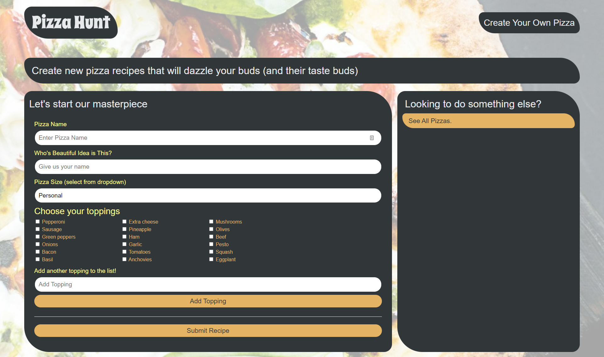

# Pizza Hunt

## Table of Contents
* [Deployed](#deployed)
* [Description](#description)
* [Technologies](#technologies)
* [Usage](#usage)
* [Preview](#preview)
* [Questions](#questions)
* [Credits](#credits)

## Deployed
Access the application at https://morning-coast-45486.herokuapp.com/

## Description
Pizza Hunt is your source to discover a new world of pizza! If you have a pizza idea that you'd love to share, you can create a pizza with your desired toppings. Don't see a topping on this list? Add it to the list! You can browse through pizzas created by other users, post your own, and even leave comments to discuss your pizzas.

## Technologies
* HTML
* CSS
* JavaScript
* Express
* MongoDB
* Mongoose
* IndexedDB

## Usage
On the home page, you will see a collection of pizzas created by all users.

Select "See the discussion" at the bottom of each card to view comments.

On the pizza's page, you can view existing comments and add a reply to a comment. You can also create your own comment to start a new thread.

From the home page, select "Create a new pizza" from the top right corner to begin crafting your masterpiece. Fill out all the desired fields, select all your toppings, and hit submit.

If there is a topping you want that is not on the list, add it on the pizza creation page by using the textbox under the toppings list. Select "Add Topping" and your new topping will appear in the list.

At any point, use the "Pizza Hunt" header link in the top left to return home.

## Preview

## Questions
Have questions about this project?  
GitHub: https://github.com/sarawrmas  
Email: sara.m.adamski@gmail.com

## Credits
Sara Adamski